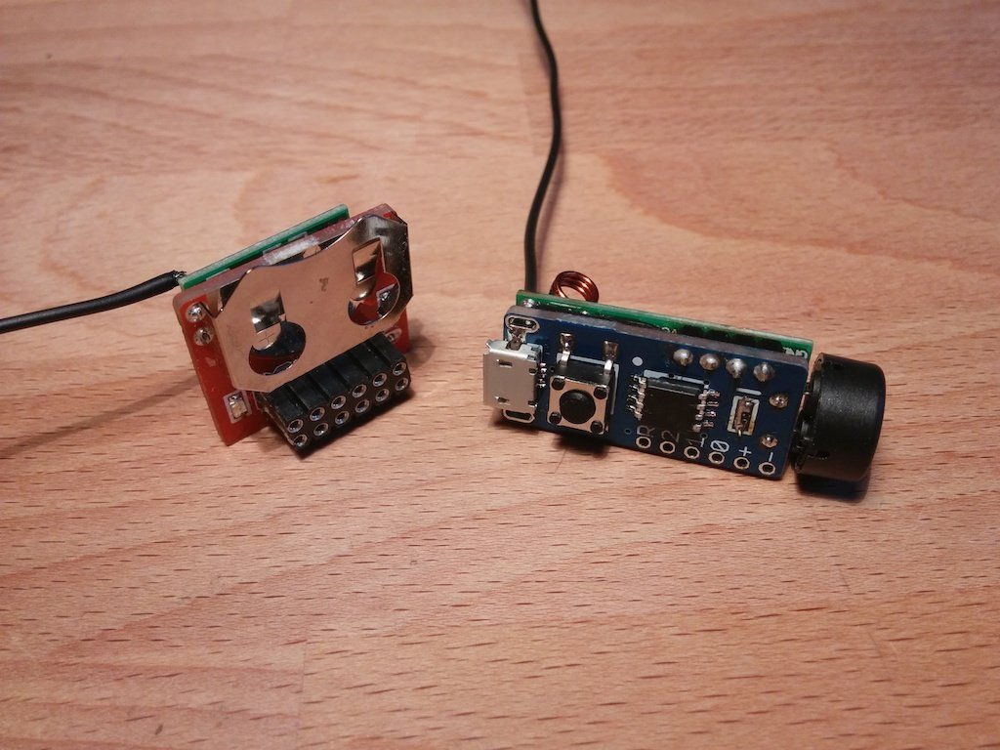

# Snail Mail Notifier

The Snail Mail Notifier is a small module based on a one-way transmitter-receiver pair and [ATtiny85](http://www.atmel.com/devices/attiny85.aspx) microcontrollers, it's purpose is to inform a user of the arrival of regular mail as soon as the mailbox lid has been opened. The receiver can notify the user via a buzzer, a blinking LED or transmit data to a computer that can forward an e-mail.

[The project development is documented on Hackaday.io](https://hackaday.io/project/1954-snail-mail-notifier).

## License

The Snail Mail Notifier is published under [Creative Commons Attribution license](http://creativecommons.org/licenses/by/3.0/).

